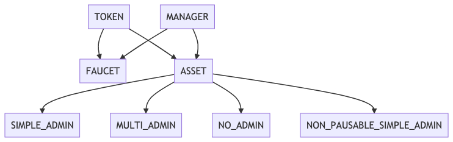

# Multi-Asset FA2 Contract for Fungible Tokens

This directory contains various flavors of a Multi-Asset Fungible Token variant of the [FA2 Token Standard](https://gitlab.com/tzip/tzip/-/blob/master/proposals/tzip-12/tzip-12.md). The contracts come with various configurations for Admin roles with respect to minting new tokens and pausing/unpausing the contract.  

 The multi-asset contract manages multiple token types. A new token can be created and configured without redeploying the contract. This design enables new functionality, such as the transfer of multiple token types at once, saving on transaction costs. 

 The code is written with a high degree of modularity with seperate components seperated into different LIGO files to ease future extension. This document will focous on these different components. 



 ## [FA2 Multi FT Token](fa2_multi_ft_token.mligo) (TOKEN)

The code in this file manages the aspects of the contract described by the [FA2 Token Standard](https://gitlab.com/tzip/tzip/-/blob/master/proposals/tzip-12/tzip-12.md). These include the entrypoints `transfer`, `balance_of`, `update_operators`.  Refer to this standard for more details. 

## [FA2 Multi FT Token Manager](fa2_multi_ft_token_manager.mligo) (MANAGER)

### TOKEN_MANAGER

The code in this file manages the Minting and Burning of tokens, which FA2 does not specify an interface for. The entrypoints this covers includes `Create_token`, `Mint_tokens`, and `Burn_tokens`.

* `Create_token`

```
create_token : pair (nat %token_id) (map %token_info string bytes) 
```

`Create_token` allows a user to create a new token by specifying a `token_id` and `token_metadata`. See [TZIP-12](https://gitlab.com/tzip/tzip/-/blob/master/proposals/tzip-12/tzip-12.md#token-metadata) for directions on how to structure the `token_metadata` map.

* `Mint_tokens`

```
Mint_tokens : (list %mint_tokens (pair (address %owner) (pair (nat %token_id) (nat %amount))))
```

`Mint_tokens` allows a user to mint tokens created with `Create_tokens` to various users in batch. 

* `Burn_tokens` 

```
Burn_tokens : (list %burn_tokens (pair (address %owner) (pair (nat %token_id) (nat %amount))))
```

`Burn_tokens` burns the specified tokens out of supply. It is the inverse of `Mint_tokens`.

### LIMITED_TOKEN_MANAGER

This is an alternative implementation of TOKEN_MANAGER used to mint a fixed supply of a given token type. It adds a single entrypoint `Mint` that creates a new token type and mints a fixed supply to the designated address. 

This token manager implementation is used in [fa2_multi_ft_asset_limited.tz](../../../../bin/fa2_multi_ft_asset_limited.tz) which corresponds to the LIGO contract [fa2_multi_ft_asset_limited.mligo](fa2_multi_ft_asset_limited.mligo). This contract also adds the `next_token_id` storage variable to the normal FT Asset storage and mints tokens incrementally instead of requiring users to pass the `token_id` they would like to mint to. 

Tokens minted using the `Mint` entrypoint are similar to those created by the editions contract [Edition set](../editions/README.md) in that both have guarantees of a fixed supply. However, they have an important difference in that tokens of the same type minted with the `limited_ft` contract share the same `token_id`, as opposed to those minted with the `editions` contract. In that sense, tokens of the same type mintd with `limited_ft` are indeed fungible.

```
(list %mint
           (pair (address %owner) (pair (nat %amount) (map %token_info string bytes))))
```


## [FA2 Multi FT Faucet](fa2_multi_ft_faucet.mligo) (FAUCET)

FAUCET simply combines the functionality provided by TOKEN and MANAGER. That is, it provides the normal FA2 token operations as well as the ability to create/mint and burn fungible tokens. It provides no admin capabilities so when compiled, any user can call the resulting contract to create/mint and burn tokens. It is also impossible to set a new admin or pause the contract.

## [FA2 Multi FT Asset](fa2_multi_ft_asset.mligo) (ASSET)

ASSET, like FAUCET, extends MANAGER and TOKEN. It also adds an interface for providing admin capabilites as well as admin checks to the entrypoints added in MANAGER. In contrast with the faucet implementation, only the admin can create, mint and burn tokens. "Admin capabilities" means the type of functionality provided by the [Admin modules](../../../fa2_modules/README.md): possibly including but not limited to the ability to add new admins, remove admins, pause the contract, and confirm an added admin (in a two-step approval pattern). ASSET will not compile on its own, but will need to be implemented by specifying which admin module ought to apply for the contract. [SIMPLE_ADMIN](fa2_multi_ft_asset_simple_admin.mligo), [MULTI_ADMIN](fa2_multi_ft_asset_multi_admin.mligo), [NO_ADMIN](fa2_multi_ft_asset_no_admin.mligo), and [NON_PAUSABLE_SIMPLE_ADMIN](fa2_multi_ft_asset_non_pausable_simple_admin.mligo) are simply ASSET implemented with different admin modules of the same name. Their respective functionalities can be read about in [Admin modules README](../../../fa2_modules/README.md). 