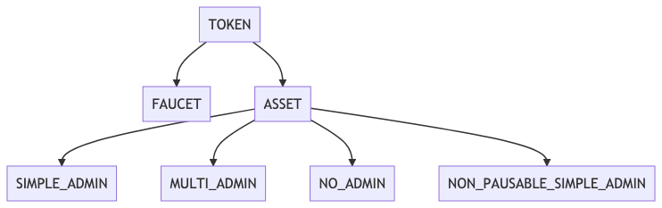

# Multi-Asset FA2 Contract for Non-Fungible Tokens

This directory contains various flavors of a Multi-Asset Non-Fungible Token variant of the [FA2 Token Standard](https://gitlab.com/tzip/tzip/-/blob/master/proposals/tzip-12/tzip-12.md). The contracts come with various configurations for Admin roles with respect to minting new tokens and pausing/unpausing the contract.  

 The multi-asset contract manages multiple token types. A new token can be created and configured without redeploying the contract. This design enables new functionality, such as the transfer of multiple token types at once, saving on transaction costs. 

 The code is written with a high degree of modularity with seperate components seperated into different LIGO files to ease future extension. This document will focous on these different components. 

 ## [FA2 Multi NFT Token](fa2_multi_nft_token.mligo) (TOKEN)

The code in this file manages the aspects of the contract described by the [FA2 Token Standard](https://gitlab.com/tzip/tzip/-/blob/master/proposals/tzip-12/tzip-12.md). These include the entrypoints `transfer`, `balance_of`, `update_operators`.  Refer to this standard for more details.

It also contains the optional implementation of a more complex FA2 transfer policy as per the specification provided in [TZIP-12](https://gitlab.com/tzip/tzip/-/blob/master/proposals/tzip-12/permissions-policy.md). This functionality can be enabled by defining the C Macro OWNER_HOOKS in contracts that extend TOKEN. 

## [FA2 Multi FT Faucet](fa2_multi_ft_faucet.mligo) (FAUCET)

FAUCET simply combines the functionality provided by TOKEN with the ability to mint an NFT. Unlike the [Fungible-Token FA2 Faucet](../ft/fa2_multi_ft_faucet.mligo), it is only possible to mint a single token for a given `token-id` (hence the name Non-Fungible). FAUCET does not provide any admin-capabilities so it is impossible to set a new admin or pause the contract. Additionally, anyone can mint new NFTs using this contract as there is no admin check. 

## [FA2 Multi FT Asset](fa2_multi_ft_asset.mligo) (ASSET)

ASSET, like FAUCET, extends MANAGER and TOKEN. However, it also adds an interface for providing admin capabilites as well as admin checks to the entrypoints added in MANAGER. "Admin capabilities" means the type of functionality provided by the [Admin modules](../../../fa2_modules/README.md): possibly including but not limited to the ability to add new admins, remove admins, pause the contract, and confirm an added admin (in a two-step approval pattern). ASSET will not compile on its own, but will need to be implemented by specifying which admin module ought to apply for the contract. [SIMPLE_ADMIN](fa2_multi_nft_asset_simple_admin.mligo), [MULTI_ADMIN](fa2_multi_nft_asset_multi_admin.mligo), [NO_ADMIN](fa2_multi_nft_asset_no_admin.mligo), and [NON_PAUSABLE_SIMPLE_ADMIN](fa2_multi_nft_asset_non_pausable_simple_admin.mligo) are simply ASSET implemented with different admin modules of the same name. Their respective functionalities can be read about in [Admin modules README](../../../fa2_modules/README.md). 