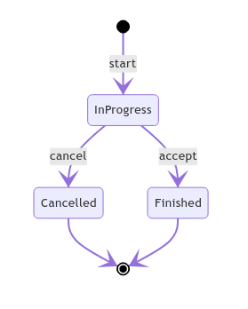

# Swaps contract

Swaps contract allows one participant (a seller) to offer an exchange with FA2 tokens, that may be accepted by another participant.

Table of contents:
* [Build instructions](#build-instructions)
* [Basic swap contract](#basic-swap-contract)
  * [Types](#swap-basic-types)
  * [Entrypoints](#swap-basic-entrypoints)
  * [Notes to the middleware implementors](#notes-to-the-middleware-implementors)
* [Allowlisted extension](#allowlisted-extension)
  * [Contract parts](#contract-parts)
  * [Types](#allowlist-types)
  * [Entrypoints](#allowlist-entrypoints)

## Build instructions

To compile the contracts, run `yarn compile-ligo`.

## Basic swap contract

Source code: [ligo](fa2_swap.mligo).

This contract may contain a multitude of swaps, each of them follows the life-cycle presented in the diagram:



<a name="swap-basic-types"></a>
### Types

The following types are expressed in cameligo.

#### Basic types

A `swap_id` type represents identifier assigned to a single exchange event.

```ocaml
type swap_id = nat
```

A `fa2_tokens` type represents several FA2 tokens of specific type.

```ocaml
type fa2_tokens =
  [@layout:comb]
  { token_id : nat
  ; amount : nat
  }
```

A `fa2_assets` type represents a list of tokens within one FA2 contract.

```ocaml
type fa2_assets =
  [@layout:comb]
  { fa2_address : address
  ; tokens : fa2_tokens list
  }
```

Note that we expect that provided list of tokens will be grouped by FA2 contracts the tokens belong to. Despite the more complicated interface, this lets us require fewer `get_entrypoint_opt` calls and make use of FA2 batched transfers and thus be much more efficient.

A `swap_offer` type contains all the data provided at swap creation.

```ocaml
type swap_offer =
  [@layout:comb]
  { assets_offered : fa2_assets list
  ; assets_requested : fa2_assets list
  }
```

A `swap_info` type represents all the full information stored about a single swap.

```ocaml
type swap_info =
  [@layout:comb]
  { swap_offer : swap_offer
  ; seller : address
  }
```

#### Storage

Entries in storage include:
* `%swaps : (swap_id ,swap_info) big_map` with all the swaps.

<a name="swap-basic-entrypoints"></a>
### Entrypoints

Notes:
* By *transfer* (in the context of FA2 tokens) we mean "performing a zero-xtz transaction that invokes FA2 `transfer` entrypoint".
* Entrypoints that perform FA2 transfer may throw the respective errors enlisted in [FA2 interface](https://gitlab.com/tzip/tzip/-/blob/master/proposals/tzip-12/tzip-12.md#error-handling).

#### %start

```ocaml
| Start of swap_offer
```

Proposes an exchange.

This transfers the `assets_offered` tokens from the `sender` to our contract (thus assuming that our contract has been made an operator of the sender's tokens).

The swap will have `Open` state, and its `seller` will be initialized to the current `sender`.

The contract automatically assigns a `swap_id` (basing on an auto-incrementing counter) to the swap. We assume that it is the caller's responsibility to extract and record the `swap_id`, it will be available in the applied operation.

In case some of `assets_offered.fa2_address` refer to an invalid FA2 contract (not originated or without `transfer` entrypoint), `SWAP_OFFERED_FA2_INVALID` is raised.

In case any tokens transfer from `sender` to our contract fails (due to lack of tokens or other issues), the respective FA2 error is propagated.

`assets_requested` is not validated and must be checked by the client for a better UX.

We do not check whether any assets list is empty on purpose.

#### %cancel

```ocaml
| Cancel of swap_id
```

Marks the swap as canceled and returns the tokens to the `seller`. Further operations with this swap won't be possible.

Can be called only by the `seller`, otherwise `NOT_SWAP_SELLER` error is raised.

The swap gets removed from big_map, any further operation for this swap will raise `SWAP_NOT_EXIST`.

#### %accept

```ocaml
| Accept of swap_id
```

This
1. Transfers the offered assets from our contract to the `sender`;
2. Transfers the requested assets from the `sender` to the `seller`.

Marks the swap as finished by the current `sender`. Further operations with this swap won't be possible.

This can be called by *any* address.

The swap gets removed from big_map, any further operation for this swap will raise `SWAP_NOT_EXIST`.

In case some of `assets_requested.fa2_address` refer to an invalid FA2 contract (not originated or without `transfer` entrypoint), `SWAP_REQUESTED_FA2_INVALID` is raised. This error normally should not happen, as the client is supposed to validate `assets_requested` on swap start.

In case any tokens transfer mentioned above fails (due to lack of tokens or other issues), the respective FA2 error is propagated.

### Notes to the middleware implementors

Any client working with this contract has to care about supplying the proper input.

#### Grouping by FA2 address

Assets accepted by `%start` entrypoint has to be grouped by FA2 token address.
In case this is not done, the performance (and fees) may be far from optimal.

#### Validating `assets_requested`

Upon executing `%start` entrypoint, the client has to check `assets_requested`:
  * That the referred FA2 token addresses exist in the chain;
  * That contract with those addresses contain `%transfer` entrypoint;
  * That referred `token_id`s are supported by the FA2 (can be checked in TZIP-16 metadata).

Checking `assets_offered` this way is not strictly necessary as the contract will raise an error in case offered assets are not correct.

#### Errors handling

Be sure to handle not only the errors listed in the entrypoints description, but also errors inherent to FA2 interface.

### Design choices

1. Forbid empty offered/requested assets to avoid user's mistakes.
2. Preserve info about resolved swaps in storage - decided not to go with this is favor of using blockchain explorers.

## Allowlisted extension

This contract additionally provides a way to restrict the set of allowed FA2 tokens that can participate in exchanges.
This set is managed by the administrator entity.

Source code: [ligo](fa2_allowlisted_swap.mligo).

### Contract parts

The plan is to develop one contract consisting of a few components that can be reused for other purposes.

The contract has to consist of the following parts:
1. Base swap contract;
2. Simple administrator contract. We picked the existing [`simple_admin` contract](../../fa2_modules/admin/non_pausable_simple_admin.mligo) that is already present in the `minter-sdk` repository.
3. Allowlisting component (reuses the swaps contract and implements the allowlisting capabilities).

The last point will be described further in this document.

<a name="allowlist-types"></a>
### Types

The storage of the allowlist component is solely `big_map address ()`.

We do not use mere `list` or `set` because `big_map` is more efficient for the `Start` entrypoint.

<a name="allowlist-entrypoints"></a>
### Entrypoints

#### Update allowlist

```ocaml
| Update_allowed of (address, unit) big_map
```

This entrypoint allows setting a new allowlist, overriding the current one.

It accepts `(address, unit) big_map` for the sake of efficiency (allowlist is kept in this form in the storage).

Can be invoked only by the admin, fails with `NOT_ADMIN` otherwise.

### Modification of the base swaps contract

The allowlisting component provides a method for modifying behaviour of `main` of the base swaps contract. This ensures that the allowlisting capability can be composed with other extensions to the swaps contract that may be requested in the future.

#### Start swap entrypoint

In case any of `assets_offered.fa2_address` or `assets_requested.fa2_address` addresses do not appear in the allowlist `big_map`, `SWAP_OFFERED_FA2_NOT_ALLOWLISTED` or `SWAP_REQUESTED_FA2_NOT_ALLOWLISTED` error is raised respectively.

#### Cancel swap entrypoint

Not updated.

#### Accept swap entrypoint

Not updated.
